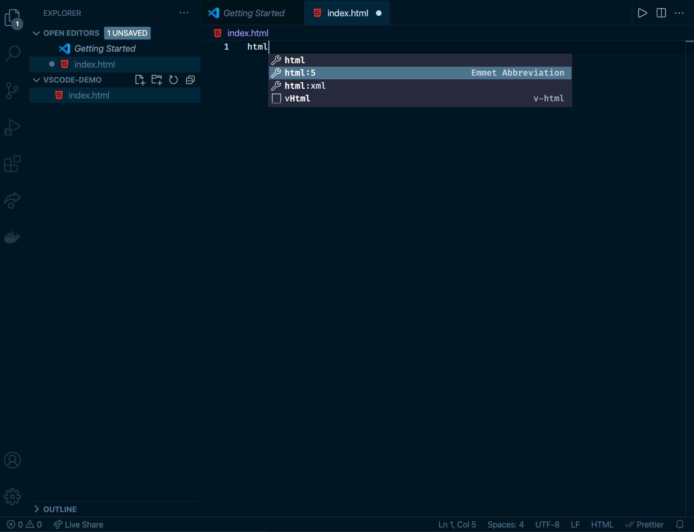
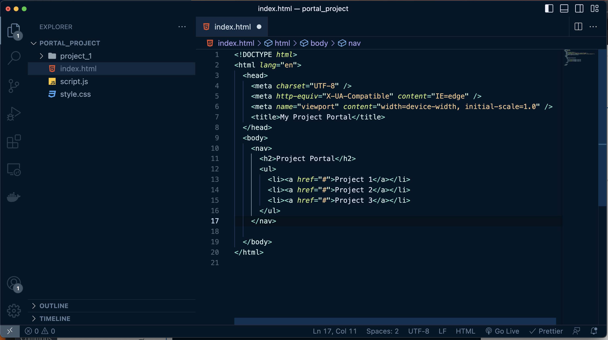
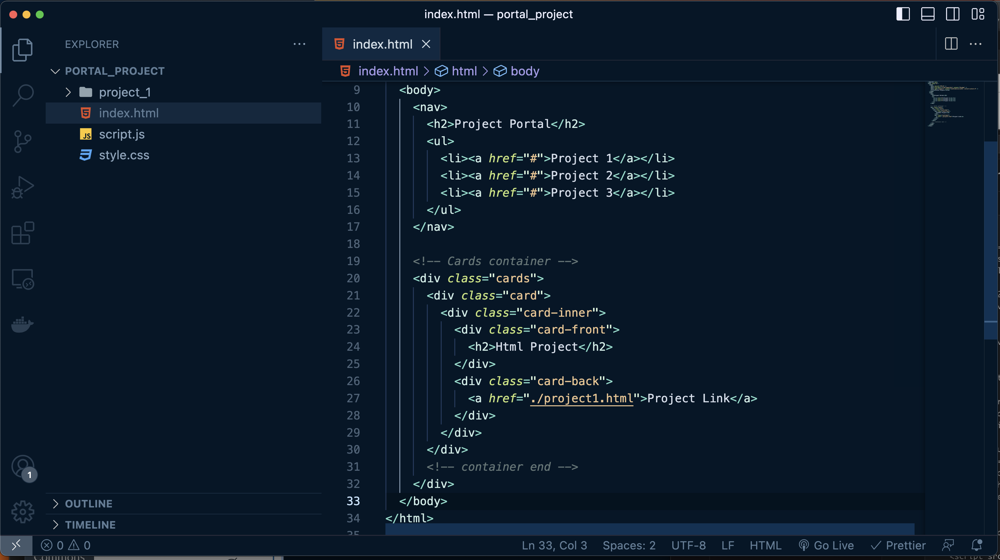
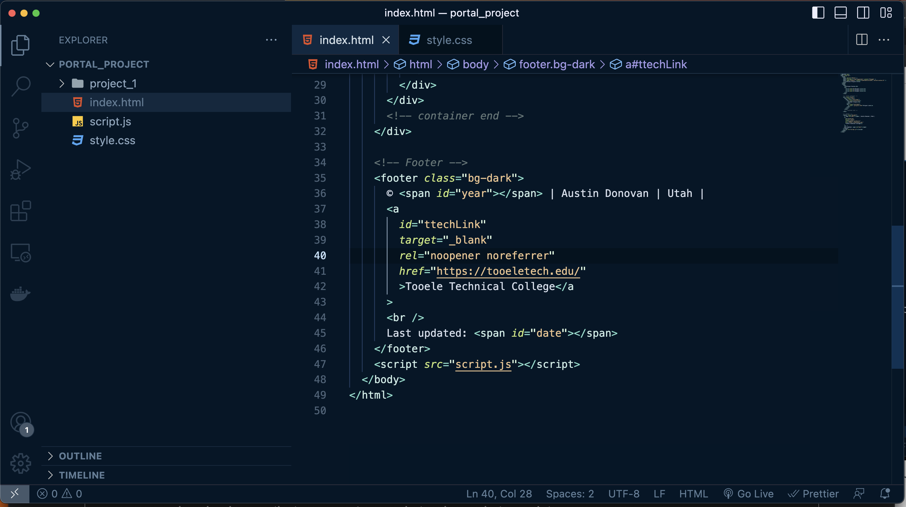
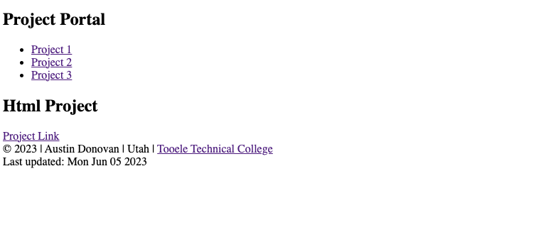

<!--To properly view this page open it in preview mode  -->

# Project:  Portal Project HTML Layout
<h2>Goal: </h2>

The goal of this project will be to give you a space to start working on your projects and get you to a point where you can create multiple projects and show them using a single portal page. You might be familiar with many other portals used on other sites, even the school uses one called the student portal. This one will include some card designs to help you show each project and include some information about it.

<b>When done you will have...</b>

<ul>
    <li>Created a simple HTML layout skeleton</li>
    <li>Built out your first few lines of code</li>
    <li>Practiced some of your skills in a separate project</li>
</ul>

<h2> Part 1: Opening your code editor</h2>

Start by opening a terminal or using the Mac search command (CMD + Spacebar) and type terminal. If you are windows, use the windows key on the keyboard and type powershell and you should be able to pull up the powershell. Once you have the powershell (or terminal) up and running, type ls on mac to check where your terminal is starting, if you are on powershell for windows, type dir (directory). You can then use the cd command to change into your documents folder and then open your sites folder, and type the following command:
<em>code .</em>

Which will open your VS Code for you to work on your next project. Now follow the next steps to start writing the code you need.

<h2>Building your first HTML project</h2>

In this section, you will run your first project. The first thing you will want to do is open the folder icon at the top in the active section(look for the red explorer button up top.) Follow these steps to open a new project. Once you've pressed the explorer button you should be greeted by this screen.

<ul> 
  <li>Click on the open folder button and choose a folder that you want to hold your projects inside. If you want, create a separate folder inside your documents folder to hold website projects and then select that specific folder.</li>
  <li>Once you open the folder you want to work in, you should see something similar to this. </li>
</ul>

<ul>
    <li>Mouse over your folder name like so, and select the first icon to create a new file called index.html, then hit enter. You should have something similar to this, also type "html" and look for a dropdown that shows html:5 and use that option, then type "Hello World" inside the body tags.</li>
</ul>

We are going to create some additional files that will be used later on. 
<ul> 
    <li>Create empty files for scripts.js and style.css in our main project folder. </li>
    <li>Then create a folder called "project_1"</li>
    <li>In that folder create a file called "project1.html"</li>
</ul>
Now in the <em>index.html</em> we are going to use <a href="https://docs.emmet.io/cheat-sheet/">emmet abbreviations</a> to create the structure of the website using the "<em>! + tab</em>" key combination.  Then change the title to "Portal Project"

Make some changes between the title tag, and then add some spacing in the body tag, so that you can start writing the HTML needed for your portal project.

You should writing code to create a navigation, look at the image below and duplicate the code:

<h3>CHALLENGE:</h3>
     Use <a href="https://www.freecodecamp.org/news/write-html-css-faster-with-emmet-cheat-codes/">emmet abbreviations</a> to create the following HTML structure in the following instructions.  Each instruction try doing with just one line of emmet notation.

Now we will want to create a card, you wont see anything inside yet, but you will later on. Write the following code here:

We are almost done, but you'll want to include a cool footer to show all the rights and trademarks for this site, so lets add that below:

So a couple of things to note here:
<ul>
    <li>You are including a bg-dark class</li>
    <li>Including a © symbol can be a challenge for you to figure out. Hint there is an HTML solution.</li>
    <li>There is a span called year, but then a pipe | separating a name, and state, then a huge link for the Tooele Tech site.</li>
    <li>Then you have a date,  it will show the current date later on.</li>
    <li>Lastly is a script that will be used to show a date, and the year.</li>
</ul>

If you want to test that your file works correctly, right-click it and use the 'open with live server'

You might not see the following:
<ul>
    <li>the year</li>
    <li>day month date</li>
</ul>
<em>Don't be alarmed we will fix that soon.</em>

 If everything else looks right lets jump into the CSS and we will get to see some changes in real time.

